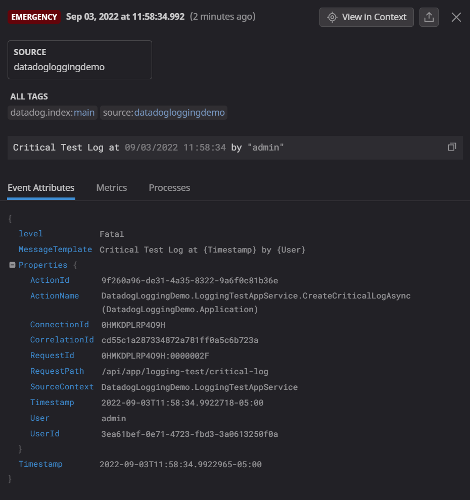

# Introduction

Logging is essential for maintaining a healthy software system, and as such it is important that you find a solution that works to help you make sense of the data you are collecting. There are a number of excellent solutions out there, so at the end of the day it comes down to the same two things: budget, and preference. The ABP Framework and the official module packages all use logging extensively, especially in error handling, and the backbone of the logging system is built on the [Serilog](https://serilog.net/) library, which gives us an incredibly wide range of integrations for aggregating our logs. This article is designed to help you take an ABP project and wire it up to my personal favorite log aggregator: [DataDog](https://app.datadoghq.com/), but the core concepts we will discuss can be used to wire up damn near any service, including the following honorable mentions:

- [Azure Application Insights](https://github.com/serilog/serilog-sinks-applicationinsights)
- [Splunk](https://github.com/serilog/serilog-sinks-splunk)
- [Elasticsearch](https://github.com/serilog/serilog-sinks-elasticsearch)
- [Seq](https://github.com/serilog/serilog-sinks-seq)

A non-exhaustive list of Serilog sinks can be found here: https://github.com/serilog/serilog/wiki/Provided-Sinks

## Source Code

The source code for this application can be found on [GitHub](https://github.com/Byteology-LLC/DatadogLoggingDemo).

# Requirements

The following tools are needed to run the solution:

- .NET 6.0 SDK
- MongoDB Server (with MongoDb Compass)
- An existing [Datadog](https://www.datadoghq.com/) account (you can get a free trial, but the pricing for log management is very cheap long-term)
  - Keep track of your API key, since you will need that later in the code.

# Datadog

I am deviating from my normal structure here a little bit to give some background on why I am choosing to showcase Datadog's logging ingestion system as opposed to something comparative like Seq. I've been a Datadog fanboy for a long time, and over the years I've watched them grow and add features that are both incredibly useful and incredibly dynamic. That is all to say that Datadog is a really good bet for creating the fabled "single pane of glass" you want to have in a technology system, where you only need to go to one place to find the data you need to action on an issue.

For logging in particular, I like datadog for 3 really big reasons:

1. It accepts any JSON you throw at it, so you can literally find a way to aggregate everything.
2. You can extensively customize how it parses those logs in order to make your life easier. Going so far as to allow you to designate which fields it need to pay special attention to (called facets) for integrations with it's search and monitoring features.
3. You can (with paid plans) "rehydrate" and search your logs that are beyond it's default lifecycle if you need to research the longevity of an issue or similar use case.

So, the GUI may not be the prettiest, the tools may not be the most user friendly, but I am a strong believer that the platform itself is incredible and it only keeps getting better, so I will continue to be a Datadog advocate for the near future.

# Development

The article assumes you have already gone through the process of creating a Datadog account and have your API key. If you have not already done that, get that done now and copy your API key somewhere safe and then move onto the next step.

## Build a new ABP project

This is going to be a simple project, so we are going to use the following command to create it (**note:** I am using the latest release candidate version but there is nothing in this article specific to that version, so you can drop the --version argument if you want):

```cmd
abp new DatadogLoggingDemo -t app -u mvc --mobile none --database-provider mongodb -csf --version 6.0.0-rc.3
```

## Install the Serilog sink in your `DatadogLoggingDemo.Web` project

Using the Package Manager Console, set the default project to the `DatadogLoggingDemo.Web` project and then run the following command:

```powershell
Install-Package Serilog.Sinks.Datadog.Logs
```

## Update the Serilog settings in the `Program.cs` file

To configure the serilog integration, we are going to use the most basic example provided by Datadog in the following document: https://docs.datadoghq.com/logs/log_collection/csharp/?tab=serilog 

At the top of the `Program.cs` file, add the following using statement: `using Serilog.Sinks.Datadog.Logs;`.

Then, in the `Main` method under where it defines the `LoggerConfiguration` add the following  line right before the `.CreateLogger()` call:

```c#
.WriteTo.DatadogLogs("<your api key>", configuration: new DatadogConfiguration() { Url = "https://http-intake.logs.datadoghq.com" })
```

So your entire logging function should look something like this:

```c#
        Log.Logger = new LoggerConfiguration()
#if DEBUG
            .MinimumLevel.Debug()
#else
            .MinimumLevel.Information()
#endif
            .MinimumLevel.Override("Microsoft", LogEventLevel.Information)
            .MinimumLevel.Override("Microsoft.EntityFrameworkCore", LogEventLevel.Warning)
            .Enrich.FromLogContext()
            .WriteTo.Async(c => c.File("Logs/logs.txt"))
            .WriteTo.Async(c => c.Console())
            .WriteTo.DatadogLogs(
                "NOTMYREALAPIKEY", 
                source: "DatadogLoggingDemo",
                configuration: new DatadogConfiguration() { Url = "https://http-intake.logs.datadoghq.com" })
            .CreateLogger();
```

What this does is it tells Serilog to write any logs to the Datadog endpoint, as well as the default Console and File options. If you wanted to add more in here you could, but remember that logging is synchronous so a slow log endpoint will impact your application performance. For now, we will keep it with Datadog since the service is like a messaging queue and shouldn't really ever be so slow that it impacts your application performance.

This is basically it. Your logs should now be flowing into the datadog logging endpoint.

## Run the DBMigrator and then run the application

Run the DBMigrator and then run the application as it currently stands. You won't even have to log into the application for the logs to already be flowing into datadog.

## Ensure logs appear in Datadog

Log into Datadog and navigate to "Logs -> Search". You should see your logs flowing in, and if you expand the "Source" in the facets column you should see our *datadogloggingdemo* listed there.


# Diving deeper

Now, what you have here should be enough for just getting logging up and running, but I want to dig a little deeper and show you some useful examples of how we can leverage this new system for better diagnostics. What we will do is modify the existing application to throw some standard logging at different levels and then see how those look in the datadog platform, hopefully giving you some understanding of the value these platforms bring to the table.

## Create the `ILoggingTestAppSerivce` interface

In your `DatadogLoggingDemo.Application.Contracts` folder, create a new file called `ILoggingTestAppService` and add the following content:

```c#
using System.Threading.Tasks;
using Volo.Abp.Application.Services;

namespace DatadogLoggingDemo
{
    public interface ILoggingTestAppService : IApplicationService
    {
        Task CreateWarningLogAsync(string message = "");
        Task CreateErrorLogAsync(string message = "");
        Task CreateCriticalLogAsync(string message = "");
        Task CreateTraceLogAsync(string message = "");
        Task CreateInfoLogAsync(string message = "");
        Task SimulateExceptionAsync();
    }
}
```

## Crete the `LoggingTestAppService` class

In your `DatadogLoggingDemo.Application` project, create a new file called `LoggingTestAppService` and add the following content:

```c#
namespace DatadogLoggingDemo
{
    public class LoggingTestAppService : DatadogLoggingDemoAppService, ILoggingTestAppService
    {
        private readonly ILogger<LoggingTestAppService> _logger;
        private readonly ICurrentUser _currentUser;

        public LoggingTestAppService(ILogger<LoggingTestAppService> logger, ICurrentUser currentUser)
        {
            _logger = logger;
            _currentUser = currentUser;
        }

        /// <summary>
        /// Writes a Critical-level log to the stream
        /// </summary>
        /// <param name="message">Optional: A message to include in the log.</param>
        /// <returns></returns>
        public async Task CreateCriticalLogAsync(string message = "")
        {
           if(!string.IsNullOrWhiteSpace(message))
            {
                _logger.LogCritical(message);
            }
            else
            {
                var timestamp = DateTime.Now;
                var user = _currentUser.IsAuthenticated ? _currentUser.Name : "Unauthenticated User";
                _logger.LogCritical("Critical Test Log at {Timestamp} by {User}", timestamp, user);
            }
        }

        /// <summary>
        /// Writes a Error-level log to the stream
        /// </summary>
        /// <param name="message">Optional: A message to include in the log.</param>
        /// <returns></returns>
        public async Task CreateErrorLogAsync(string message = "")
        {
            _logger.LogError(string.IsNullOrWhiteSpace(message) ? "Error Test Log" : message);
        }

        /// <summary>
        /// Writes a Information-level log to the stream
        /// </summary>
        /// <param name="message">Optional: A message to include in the log.</param>
        /// <returns></returns>
        public async Task CreateInfoLogAsync(string message = "")
        {
            _logger.LogInformation(string.IsNullOrWhiteSpace(message) ? "Info Test Log" : message);
        }

        /// <summary>
        /// Writes a Trace-level log to the stream
        /// </summary>
        /// <param name="message">Optional: A message to include in the log.</param>
        /// <returns></returns>
        public async Task CreateTraceLogAsync(string message = "")
        {
            _logger.LogTrace(string.IsNullOrWhiteSpace(message) ? "Trace Test Log" : message);
        }

        /// <summary>
        /// Writes a Warning-level log to the stream
        /// </summary>
        /// <param name="message">Optional: A message to include in the log.</param>
        /// <returns></returns>
        public async Task CreateWarningLogAsync(string message = "")
        {

            _logger.LogWarning(string.IsNullOrWhiteSpace(message) ? "Warning Test Log": message);
        }

        /// <summary>
        /// Throws a UserFriendlyException to demonstrate the logging on ABP handled exceptions.
        /// </summary>
        /// <returns></returns>
        public async Task SimulateExceptionAsync()
        {
            throw new UserFriendlyException("This is a test exception");
        }
    }
}
```

Now ABP will automagically create the controllers and everything else, so now we move onto the UI elements.

## Add some buttons on your Index page

Since I am using the MVC template, my main page is the `Index.cshtml` page in the `Pages` directory of the `DatadogLoggingDemo.Web` project. If you are using a different template, find your main start page and add a few buttons there to simulate each one of those methods we created in our AppService.

For MVC, I added a section that looked like this

```html
    <div class="card">
        <div class="card-body">
            <div class="row">
                <button data-level="error" class="btn btn-primary simulate">Send Error Log</button>
                <button data-level="warning" class="btn btn-warning simulate">Send Warning Log</button>
                <button data-level="critical" class="btn btn-danger simulate">Send Critical Log</button>
                <button data-level="trace" class="btn btn-secondary simulate">Send Trace Log</button>
                <button data-level="info" class="btn btn-info simulate">Send Info Log</button>
                <button data-level="exception" class="btn btn-dark simulate">Simulate Exception</button>
            </div>
        </div>
    </div>
```

Then I jumped over to the `index.js` file and added the following javascript content:

```javascript
$(".simulate").click(function () {
    var logger = datadogLoggingDemo.loggingTest;
    var notification = "log";

    switch ($(this).data("level")) {
        case "error":
            logger.createErrorLog();            
            break;
        case "warning":
            logger.createWarningLog();
            break;
        case "critical":
            logger.createCriticalLog();
            break;
        case "trace":
            logger.createTraceLog();
            break;
        case "info":
            logger.createInfoLog();
            break;
        default:
            logger.simulateException();
            notification = "exception";
            break;
    }
    abp.notify.success("Successfully tested " + notification);

});
```

If any of that javascript confuses you, I would recommend you read up on the way ABP automagically creates the javascript API proxies here: https://docs.abp.io/en/abp/latest/UI/AspNetCore/Dynamic-JavaScript-Proxies. Essentially what we are doing is telling the JS to hit our `LoggingTestAppService` code via it's dynamically created remote endpoint.

## Run the app and spam the buttons

At this point you should be able to run the app and see your buttons:


Pressing the log buttons should produce a nice little notification about it being successful:


and pressing the Exception button should produce the notification as well as an exception alert:


This is how you know it is all working as expected. Be sure to trigger at least one critical log and one exception (both before and after you log in) and then move over to datadog to digest the logs.

## Playing around with filters in Datadog

Heading back over to the Datadog log search window, we can expand the "Status" facet and uncheck the boxes next to the *info* and *debug* options to filter out some of the noise and see that we are left with just the Warning, Error, Critical and exception related logs.


Now, if we wanted to create a saved view in datadog that just shows us these specific criteria, you click the "+ Save" button in the upper left corner of the window and you will have a view that you can switch to to quickly filter out the clutter in your logs:


So, just like that, you've now got a filtered diagnostic window showing just the things that are important to you. Now let's take a look at an actual log and what it shows.

## Inspecting the Critical log

Inspecting the "Emergency" status log (which translates to our Critical log in .NET) the first thing you the handy color coding that Datadog applies. That makes it very easy to pick out similarly leveled logs in the main flow. Clicking on this log will bring up the detail view for that specific log. Right away we can see the following important details:

- The method name where the log was created (called "ActionName") and which project it was in
- The request path for the API
- The class that was being called when the log was created (called SourceContext)
- The custom data (in this case, the **Timestamp** and **User** values we passed into the code) are serialized as individual fields that can be used for searching or creating facets with later.

As a developer, you now have enough information to find the exact method where the log was created and you will have any additional details that you pass into the log right in front of you.



## Inspecting the Exception

Close the detail view for the critical log and find the exception log in the list and click on that. Right away you are going to notice the same information you had in the critical log, but also the stack trace is going to be available to you in the "Exception" field. Again, as a developer this information is incredibly useful for diagnosing issues that occur in your production environment.


You will also notice that logs created by authenticated users have the **UserId** field attached, which makes it even easier to trace context.

## Log context

Sometimes, having the error isn't enough and you need to better understand how a user got to where they were at to throw the exception. In the "detail view" window there is a "View in Context" button in the upper-right corner that will bring you to your default log view and highlight the specific log that you were looking at, which will give you some details about the debug and info logs that were created around the same time.


In my screenshot, you can see the info log referring to the execution of my `DatadogLoggingDemo.LoggingsTestAppService.SimulateExceptionAsync` endpoint, so you know a user triggered that first, then the route matched to a remote endpoint, then the exception was triggered. It is pretty easy now to follow the logs through the events that took place before the exception was triggered.

# Conclusion

In conclusion, I think that we covered a lot of territory regarding the usefulness of creating a logging situation that you as the developer can use to get the information you need to maintain the health of your software. Datadog is my personal favorite flavor, but there are so many options out there to choose from that I encourage you to play around with things and better understand what works best for you. At the end of the day, a comprehensive logging solution is going to make your life a lot easier, so it's worth spending the time to find something that you like and that makes you the most efficient.
